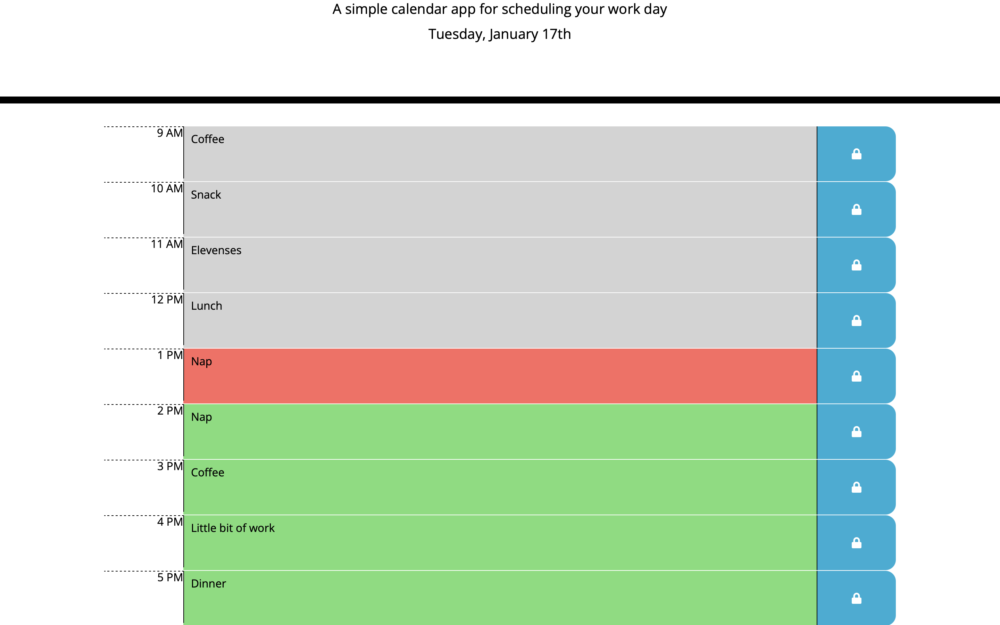

# daily-planner

## Goal
The objective of this week's challenge was to create a simple calendar application that allows a user to save events for each hour of the day by modifying starter code. This app will run in the browser and feature dynamically updated HTML and CSS powered by jQuery and we had to also use Moment.JS to deal with time.

## Implementation
Another nice little project to practice newly gained skills. I wasn't aware of Moment.js existence up until now and I've never used jQuery before. While Moment.js seems to be expendable and can be easily substituted by JS Date module I believe that jQuery shortened the code and improved it's readability considerably. Most of my work was on js file leaving index.html unchanged and style.css tweaked just a bit.

You can have a look at the site here: https://michalous.github.io/daily-planner